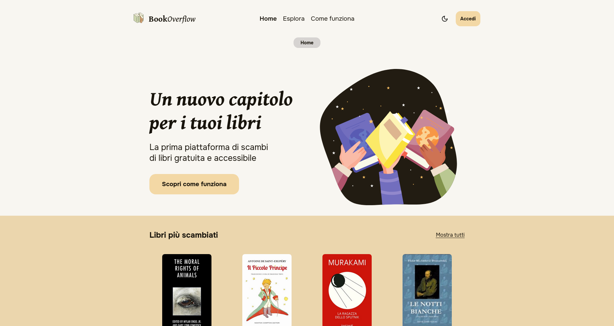
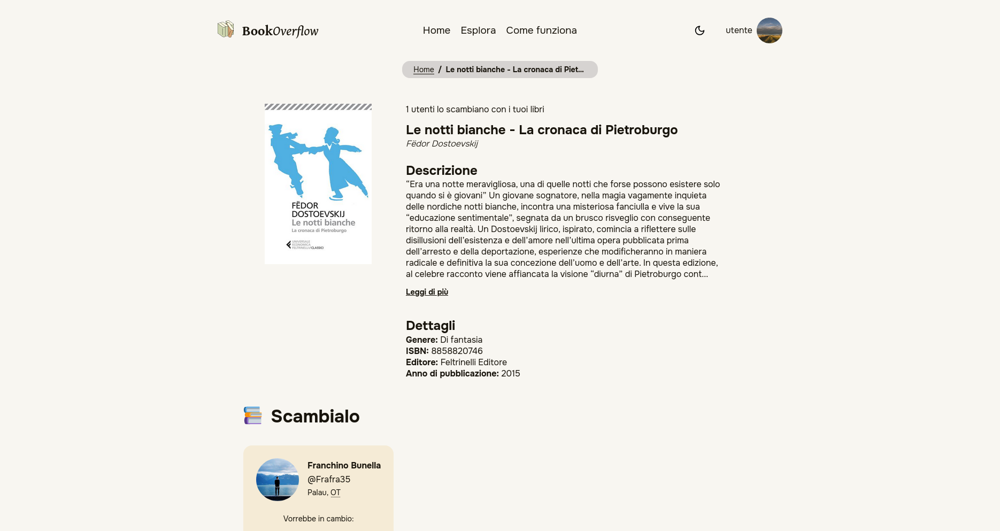
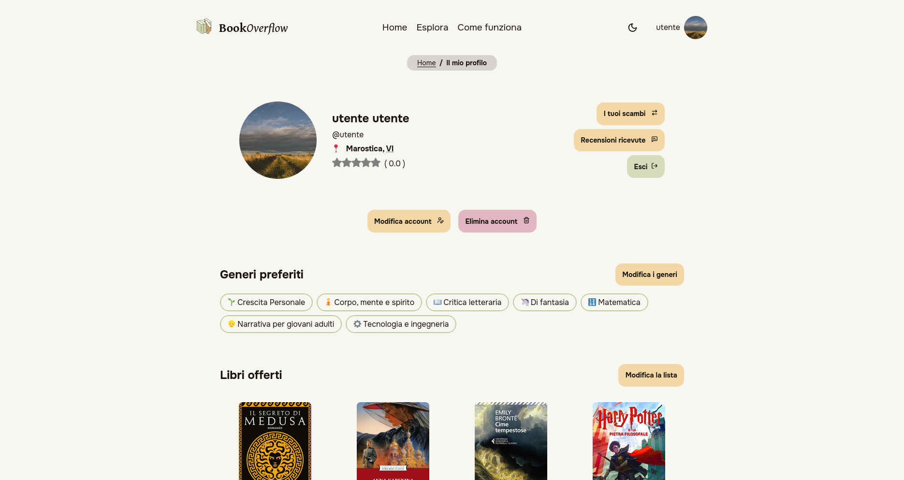

<p align="center">
  <picture>
    <source media="(prefers-color-scheme: dark)" srcset=".github/BookOverflow-dark.svg">
    
  </picture>
</p>

# 

A website developed for the Web Technologies course at the University of Padua (BSc in Computer Science, Academic Year 2022/23).

The project received a grade of 30/30 and has been selected as the winner of the "[Accattivante Accessibile 2025](https://ilbolive.unipd.it/it/event/ateneo/accattivante-accessibile)" contest organized by the University of Padua.

>BookOverflow is the place where books never end. 
>Like [_StackOverflow_](https://stackoverflow.com/) for programmers, here book lovers discover an "overflow" of stories, connections, and possibilities—all without spending a single penny.  
>
>The beauty of BookOverflow lies in its ability to transform forgotten books on shelves into opportunities, while also committing to reducing the environmental impact of the publishing industry by promoting *sustainable* practices.  
# Course requirements
The course requires all projects to meet the following requirements:
- The website must be built using **XHTML Strict** or **HTML5**. HTML5 pages must degrade gracefully and adhere to XML syntax.  
- The layout must be implemented using **pure CSS** (CSS2 or CSS3).  
- The use of **flexbox** and **CSS grid** layouts, if implemented correctly, will be highly regarded.  
- The website must ensure complete separation between **content** and **presentation**.
- The website must be accessible to **all user groups**.  
- The website must organize its content to ensure it is **easily retrievable** by any user.  
- The website must include pages that use **PHP scripts** to collect and display user-submitted data (including functionality to **edit** and **delete** the data).  
- The website must implement **input validation**, both **client-side** and **server-side**.  
- User-submitted data must be stored in a **database**.  
- The database should preferably adhere to **normalized form**.  

The website must be based on the **LAMP stack**.

# Screenshots
<picture>
  <source media="(prefers-color-scheme: dark)" srcset=".github/screen1-dark.png">
  
</picture>
<picture>
  <source media="(prefers-color-scheme: dark)" srcset=".github/screen2-dark.png">
  
</picture>
<picture>
  <source media="(prefers-color-scheme: dark)" srcset=".github/screen3-dark.png">
  
</picture>

# Installation
## With Docker-Compose
1. Clone the repository:
```bash
git clone https://github.com/BookOverflowLib/BookOverflow.git
```
2. Move to the project directory:
```bash
cd BookOverflow
```
3. Create a `.env` file:
```bash
cp .env.example .env
```
4. Start the containers:
```bash
docker-compose up --build 
```
The website will be available at `http://localhost:8080`; A phpMyAdmin instance will be available at `http://localhost:8081`.

> [!NOTE]  
> The `--build` flag can be omitted after the first run.

## Manual, for UniPD's servers
> [!IMPORTANT]
> SSH keys must be set up first, using 
> ```bash
> ssh-copy-id USERNAME@paolotti.studenti.math.unipd.it    
> ssh paolotti.studenti.math.unipd.it -l USERNAME -L8080:tecweb:80 -L8443:tecweb:443 -L8022:tecweb:22
> ```
> then in a new terminal
> ```bash
> ssh-copy-id -p 8022 USERNAME@127.0.0.1
> ```

### For tecweb servers:
1. Open an SSH tunnel to the server:
```bash
ssh paolotti.studenti.math.unipd.it -l USERNAME -L8080:tecweb:80 -L8443:tecweb:443 -L8022:tecweb:22
```
2. Upload new files to the server:
```bash
rsync -e "ssh -p 8022 " -avrP --exclude-from=.rsyncignore . USERNAME@localhost:public_html 
```
3. Import the database:
```bash
ssh -p 8022 USERNAME@localhost
./public_html/utils/import_db_tecweb.sh
```
4. Generate the `.env` file:
```bash
[ "$(basename "$PWD")" != "public_html" ] && cd public_html; username=$(whoami) && DB_HOST="localhost" DB_DATABASE="$username" DB_USERNAME="$username" DB_PASSWORD="$(cat ../pwd_db_2024-25.txt)" PREFIX="/$username" && echo -e "DB_HOST=$DB_HOST\nDB_DATABASE=$DB_DATABASE\nDB_USERNAME=$DB_USERNAME\nDB_PASSWORD=$DB_PASSWORD\nPREFIX=$PREFIX" > .env
```

### For CAA servers:
1. Upload new files to the server:
```bash
  rsync -avrP --exclude-from=.rsyncignore . USERNAME@caa.studenti.math.unipd.it:public_html
```
2. Import the database:
```bash
  ssh USERNAME@caa.studenti.math.unipd.it:public_html
  ./utils/import_db_caa.sh
```
3. Generate the `.env` file:
```bash
[ "$(basename "$PWD")" != "public_html" ] && cd public_html; username=$(whoami) && DB_HOST="localhost" DB_DATABASE="$username" DB_USERNAME="$username" DB_PASSWORD="$(cat ../pwd_db_caa.txt)" PREFIX="/$username" && echo -e "DB_HOST=$DB_HOST\nDB_DATABASE=$DB_DATABASE\nDB_USERNAME=$DB_USERNAME\nDB_PASSWORD=$DB_PASSWORD\nPREFIX=$PREFIX" > .env
```
